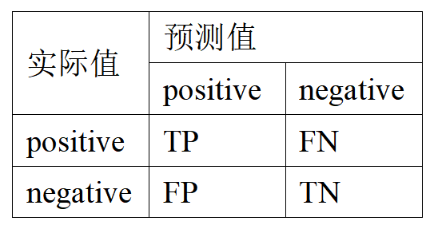
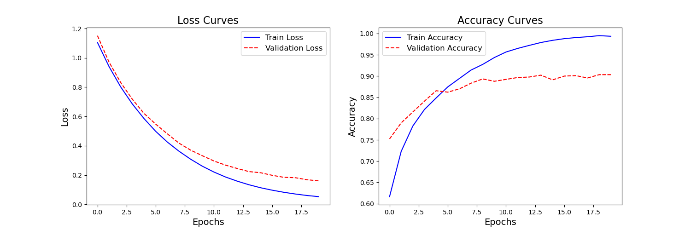
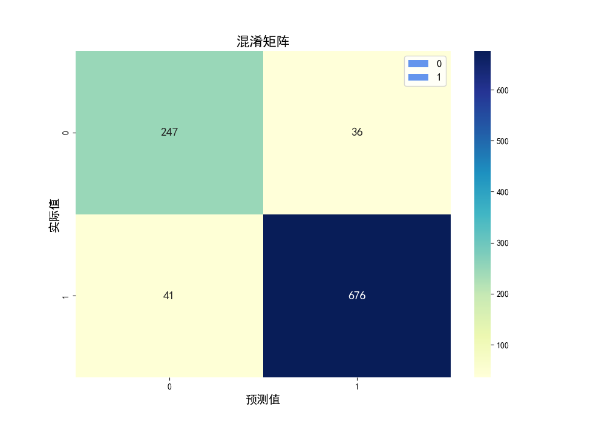

# 基于 Word2Vec 和 TextCNN 进行中文情感分析

## 实验数据集

中科院谭松波博士收集整理语料规模为10000的ChnSentiCorp-Htl-ba10000数据集。

## 实验环境

|    实验环境    |  版本  |
| :------------: | :----: |
|     python     | 3.8.6  |
| tensroflow-gpu | 2.3.0  |
|     keras      | 2.3.1  |
|   matplotlib   | 3.5.3  |
|     numpy      | 1.18.5 |
|     scipy      | 1.4.1  |
|     pandas     | 1.0.5  |

## 参数设置

| 参数名                    | 值    | 参数名       | 值                   |
| ------------------------- | ----- | ------------ | -------------------- |
| 词向量维度（embedding）   | 300   | 优化器       | Adam                 |
| 最大序列长度（maxlen）    | 256   | 学习率       | 5e-5                 |
| 卷积核大小（filters）     | 256   | 损失函数     | WeightedCrossEntropy |
| 卷积核大小（kernel_size） | 3,4,5 | 小批量样本数 | 64                   |
| Dropout                   | 0.2   | 迭代次数     | 20                   |

其中最大序列长度（maxlen）根据统计数据集中序列的长度分布情况来确定。可以绘制直方图或使用描述性统计方法来获取最大序列长度。将maxlen设置为数据集中绝大部分序列的长度，可以最大程度地保留数据的信息。由统计图及统计信息，将maxlen设为256，可保留数据集中绝大多数信息。

## 评价指标

$$
accuracy = \frac{TP+TN}{TP+TN+FP+FN}
$$

$$
precision = \frac{TP}{TP+FP}
$$

$$
recall = \frac{TP}{TP+FN}
$$

$$
F1=\frac{2×(precision×recall)}{precision+recall}
$$

其中，评价指标中各参数含义如下图所示

## 停用词表

采用中文停用词表、哈工大停用词表、百度停用词表、四川大学机器智能实验室停用词库整合词表。

## 实验结果
**准确率： 0.923**
**Precision： 0.9235**
**Recall：0.9230**
**F1 Score：0.9232**

